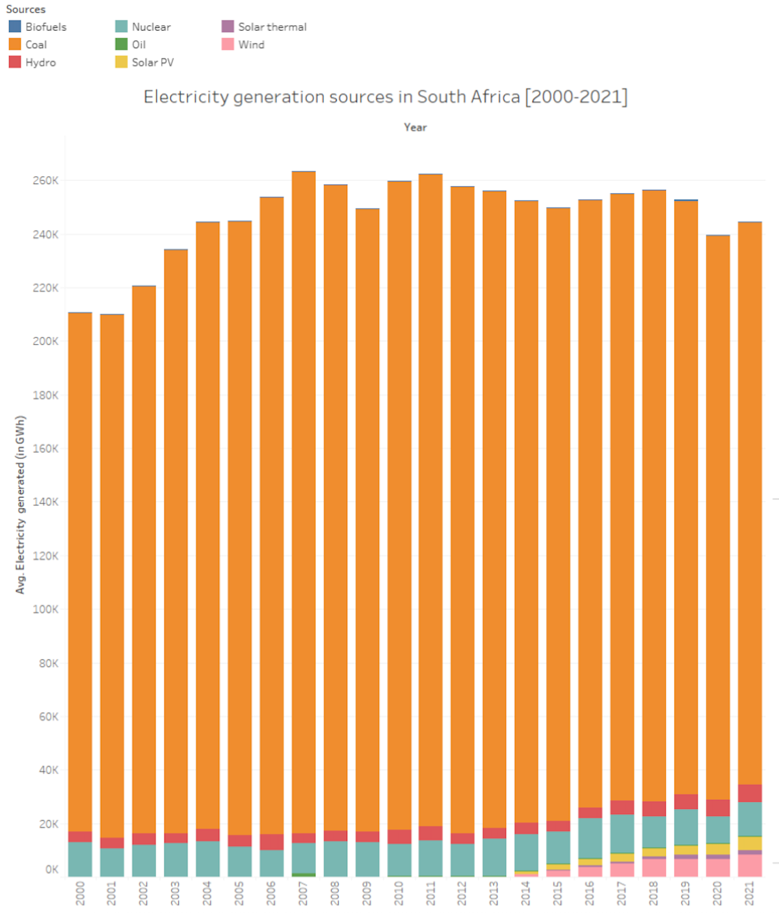
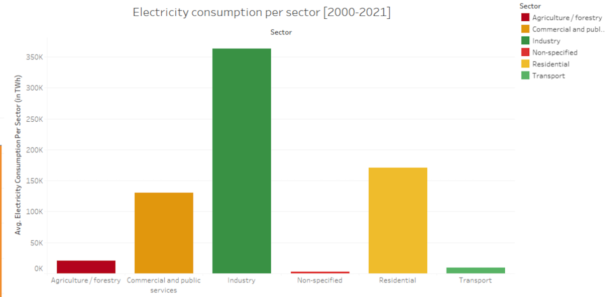
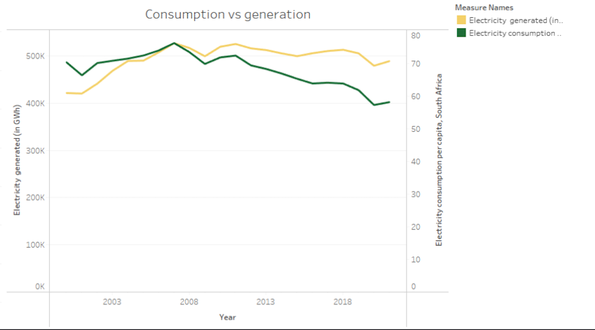

<p align="center">
  
</p>

<h1 align="center">⚡ South Africa Electricity Analytics</h1>

<p align="center">
A Business Analytics Case Study on Electricity Generation, Consumption and Load Shedding in South Africa
</p>

---

## 📖 Overview

South Africa's electricity sector continues to face significant operational challenges, including constrained generation capacity, increasing electricity demand, ageing infrastructure, and recurring load shedding.

As South Africa's primary electricity supplier, **Eskom** plays a critical role in balancing electricity generation with national demand while maintaining the stability of the country's power grid.

This project explores electricity generation sources, electricity consumption across sectors, and the relationship between electricity generation and consumption to identify insights that can support strategic decision-making and long-term energy sustainability.

> **📌 Project Attribution**
>
> This repository documents a **collaborative university data analytics project** completed as part of a team.
>
> The repository has been redesigned into a professional portfolio case study to showcase the project's analytical approach, findings, and recommendations.

---

# 📊 Project Summary

| Category | Details |
|-----------|----------|
| **Project Type** | Business Analytics Case Study |
| **Industry** | Energy & Utilities |
| **Organisation** | Eskom |
| **Project Format** | Team Project |
| **Role** | Team Member |
| **Topic** | Electricity Generation, Consumption & Load Shedding |
| **Tools** | Microsoft PowerPoint, Tableau Prep for Data Cleaning, Tableau Desktop for Data Visualisation |
| **Repository Purpose** | Portfolio Case Study |

---

# 🎯 Business Problem

South Africa has experienced recurring electricity shortages, resulting in frequent load shedding.

Balancing electricity generation with national demand remains one of Eskom's greatest operational challenges.

Understanding how electricity is generated, where it is consumed, and how demand compares to supply can support better operational planning and long-term investment decisions.

---

# ❓ Business Questions

This project explored the following questions:

- How is electricity generated in South Africa?
- Which sectors consume the most electricity?
- How does electricity generation compare with national electricity consumption?
- What insights can support more sustainable electricity planning?
- What recommendations could improve South Africa's electricity future?

---

# 🚀 Analytical Workflow

```text
📚 Business Understanding
          ↓
📊 Data Collection
          ↓
🧹 Data Preparation
          ↓
📈 Data Visualisation
          ↓
🔍 Analysis
          ↓
💡 Insights
          ↓
📋 Recommendations
```

---

# 📈 Visualisation Highlights

## ⚡ Electricity Generation Sources

<p align="center">

</p>

### Purpose

Understand South Africa's electricity generation mix and identify the country's dependence on different energy sources.

---

## 🏭 Electricity Consumption by Sector

<p align="center">

</p>

### Purpose

Identify which sectors contribute most significantly to electricity demand.

---

## ⚖️ Electricity Generation vs Consumption

<p align="center">

</p>

### Purpose

Compare electricity production with national electricity demand to understand supply and demand trends.

---

# 🔑 Key Findings

### ⚡ 1. South Africa's Electricity Generation is Dominated by Coal

The analysis shows that South Africa generates the majority of its electricity from coal-fired power stations, making coal the country's primary energy source. While renewable energy sources such as wind and solar contribute to the national electricity mix, their contribution remains comparatively small.

This reliance on coal creates long-term challenges related to ageing infrastructure, environmental sustainability, and the reliability of electricity supply.

---

### 🏭 2. Industrial Activity Represents the Largest Consumer of Electricity

Electricity consumption is not evenly distributed across sectors. The analysis indicates that industrial and commercial activities account for a significant proportion of South Africa's electricity demand, highlighting the country's dependence on electricity to support economic production.

Residential and other sectors consume comparatively less electricity but still contribute substantially to overall national demand.

Understanding sector-specific consumption patterns can help policymakers and utility providers prioritise demand management strategies and improve energy efficiency initiatives.

---

### ⚖️ 3. Electricity Supply Continues to Face Pressure from National Demand

Comparing electricity generation with national electricity consumption demonstrates the constant challenge of balancing electricity supply with demand.

Periods where electricity demand approaches or exceeds available generation capacity increase pressure on the national grid and contribute to the implementation of load shedding.

Maintaining an adequate balance between electricity generation and consumption is essential for ensuring grid stability and reducing electricity shortages.

---

### 🌱 4. Energy Diversification is Critical for Long-Term Sustainability

The findings suggest that expanding renewable energy sources and reducing dependence on conventional electricity generation will be important for improving South Africa's long-term energy resilience.

Diversifying the country's energy mix can improve electricity security, reduce pressure on ageing infrastructure, and contribute to a more sustainable electricity system.

---

### 📊 5. Data Analytics Supports Better Energy Decision-Making

The visualisations demonstrate how business analytics can transform complex electricity data into meaningful insights that support strategic decision-making.

Analysing electricity generation and consumption patterns enables stakeholders to identify operational challenges, understand demand trends, and develop evidence-based recommendations for improving South Africa's electricity sector.

---

# 💡 Recommendations

### 🌱 1. Accelerate Investment in Renewable Energy

The analysis highlights South Africa's heavy reliance on coal as its primary source of electricity generation. Expanding renewable energy sources such as solar, wind, and hydroelectric power would diversify the country's energy mix, reduce dependence on ageing coal-fired power stations, and improve long-term energy sustainability.

Increasing renewable generation capacity would also strengthen energy security and contribute to reducing greenhouse gas emissions.

---

### 🏗️ 2. Modernise and Maintain Existing Electricity Infrastructure

Ageing infrastructure remains one of the major contributors to electricity supply disruptions. Eskom should continue investing in preventative maintenance, infrastructure upgrades, and the replacement of ageing generation equipment to improve operational reliability.

A proactive maintenance strategy can reduce unplanned outages, improve plant availability, and support a more stable electricity supply.

---

### ⚖️ 3. Strengthen Electricity Supply Planning

The comparison between electricity generation and national demand demonstrates the importance of maintaining an appropriate balance between available generation capacity and electricity consumption.

Improved forecasting, demand planning, and resource allocation can enable Eskom to anticipate periods of increased demand and make more informed operational decisions to minimise the need for load shedding.

---

### 🏭 4. Promote Energy Efficiency Across High-Consumption Sectors

The analysis shows that industrial and commercial sectors account for a substantial share of electricity consumption. Encouraging energy-efficient technologies, demand-side management programmes, and responsible electricity usage within these sectors can help reduce pressure on the national grid.

Improving energy efficiency allows economic activity to continue while lowering overall electricity demand.

---

### 📊 5. Use Data Analytics to Support Decision-Making

Business analytics should continue to play a central role in monitoring electricity generation, consumption, and operational performance.

Interactive dashboards and performance monitoring systems can provide decision-makers with timely insights, helping them identify emerging trends, monitor infrastructure performance, and evaluate the effectiveness of operational strategies.

---

### 🔋 6. Invest in Future Energy Technologies

To improve the long-term resilience of South Africa's electricity system, continued investment in energy storage technologies, smart grid infrastructure, and emerging energy solutions should be prioritised.

These technologies can improve grid flexibility, better integrate renewable energy sources, and strengthen the country's ability to meet future electricity demand.
---

# 📚 Repository Navigation

| Document | Description |
|----------|-------------|
| 📘 **Business Context** | Overview of South Africa's electricity sector and Eskom's role. |
| ⚠️ **Business Problem** | The operational challenges affecting electricity generation and distribution. |
| 🗃️ **Dataset** | Description of the data used and its limitations. |
| 🔬 **Methodology** | The analytical approach followed during the project. |
| 📊 **Analysis** | Detailed discussion of each visualisation and its insights. |
| 💡 **Recommendations** | Business recommendations based on the findings. |
| 🎓 **Reflection** | Lessons learned and opportunities for future improvements. |

---

# 🛠️ Tools Used

<p align="left">


</p>

---

# 💼 Skills Demonstrated

- Business Analysis
- Data Analysis
- Data Interpretation
- Data Visualisation
- Critical Thinking
- Strategic Decision-Making
- Business Communication
- Team Collaboration

---

# 🚀 Future Improvements

Future iterations of this project could include:

- Interactive Power BI dashboards
- Tableau dashboards
- Time-series analysis
- Forecasting electricity demand
- Regional electricity analysis
- Machine learning for demand prediction
- Live electricity monitoring dashboards

---

# 📖 About This Repository

This repository forms part of my professional portfolio as an **Information Systems Professional**.

It demonstrates my ability to understand business problems, interpret data, communicate analytical findings, and present actionable recommendations through a structured business analytics case study.
